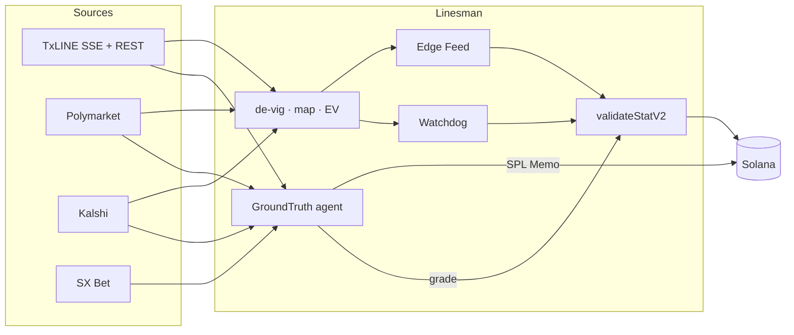

# Linesman

**The sharp line for World Cup prediction markets — and the agent that trades the lag.**

Linesman joins TxLINE’s Merkle-anchored fair value to live Polymarket and Kalshi books, surfaces mispricing in a mobile-first feed, audits settlement on Solana, and runs **GroundTruth**: an autonomous agent that acts the moment a verified match event lands — before venues finish repricing.

- **Live app** → `/feed`
- **Agent decisions** → `/agent`
- **Settlement audit** → `/watchdog`
- **Match clock / venue sim** → `/replay`
- **Trust model** → [`docs/ONCHAIN.md`](docs/ONCHAIN.md)
- **Product brief** → [`PRODUCT_BRIEF.md`](PRODUCT_BRIEF.md)
- **Liveness** → `GET /health`

## Why this wins

Prediction markets are crowd prices. Without an independent, provably computed fair line, “the crowd disagrees with itself” is the only claim you can make. TxLINE is the other half: de-vigged, Merkle-anchored, timestamped ground truth outside any venue book.

Linesman turns that into product:

1. **See the edge** — Feed ranks venue gaps vs sharp fair in plain language.
2. **Prove the number** — every card can verify against `validateStatV2` on Solana.
3. **Act on latency** — GroundTruth watches goals/cards on the TxLINE score stream, snapshots Polymarket / Kalshi / SX Bet / TxLINE bookmaker ticks, selects the slowest book, logs the decision on-chain (SPL Memo), and grades against a cryptographic final-score proof.

## Product surfaces

| Mode | Route | What you get |
| --- | --- | --- |
| **Edge Feed** | `/feed` | Ranked mispricings, Disagreement Index, honest source chip |
| **Watchdog** | `/watchdog` | Settlement audits + live venue gaps during sim |
| **Agent** | `/agent` | Live GroundTruth decision feed, P&L, per-venue reaction times, on-chain memos |
| **Replay** | `/replay` | Previous TxLINE fixtures + 1-minute Polymarket/Kalshi sim for known semis |
| **Market detail** | `/market/[id]` | Book compare + verify strip |

Activated sessions never silently fall back to mock. Source chips (`LIVE` / `REPLAY` / `DEMO DATA`) match `/api/status` and `/health`.

## Architecture



## Run it

```bash
corepack enable
pnpm install
cp .env.example .env.local
openssl rand -base64 32   # → CREDENTIAL_ENCRYPTION_KEY_BASE64
# set DATABASE_URL (Neon) in .env.local
pnpm db:migrate
pnpm dev
```

Open [http://localhost:3000](http://localhost:3000).

1. **Connect wallet** (side nav) → activate TxLINE on **devnet** (level 1, four weeks).
2. **Feed** goes live when odds + a venue book join.
3. **Replay** → England vs Argentina (or France vs Spain) for 1m candle books.
4. **Agent** → run GroundTruth against a fixture (see below), then open `/agent`.

```bash
pnpm lint
pnpm typecheck
pnpm test
pnpm exec playwright install chromium && pnpm test:e2e
pnpm build
```

## GroundTruth agent

Requires an activated TxLINE credential in the DB plus a funded agent keypair:

```bash
# One-time: agent signer (separate from the user's wallet)
node -e "const {Keypair}=require('@solana/web3.js');const bs58=require('bs58');const k=Keypair.generate();console.log(k.publicKey.toBase58());console.log(bs58.encode(k.secretKey));"
```

Set `AGENT_DEVNET_SECRET_KEY_BASE58` in `.env.local`. Optional: `OPENROUTER_API_KEY` for one-line rationales.

```bash
# Autonomous loop — replay is the reliable demo path
pnpm agent:run -- --fixtureId=18209181 --network=devnet --mode=replay --speed=300

# Scoreboard for graded decisions
pnpm agent:backtest -- --fixtureId=18209181 --network=devnet
```

Fixture IDs live in `src/lib/txline/worldcup-schedule.ts`.

## Venue coverage

| Venue | Feed / Watchdog | Agent |
| --- | --- | --- |
| TxLINE sharp + bookmaker ticks | ✅ | ✅ |
| Polymarket | ✅ live + 1m history | ✅ live + history |
| Kalshi (`KXWCGAME`) | ✅ live + 1m history | ✅ live + history |
| SX Bet | — | ✅ live |

## TxLINE networks

| Network | Program | Host | Free levels |
| --- | --- | --- | --- |
| devnet | `6pW64gN1s2uqjHkn1unFeEjAwJkPGHoppGvS715wyP2J` | `https://txline-dev.txodds.com` | `1` |
| mainnet | `9ExbZjAapQww1vfcisDmrngPinHTEfpjYRWMunJgcKaA` | `https://txline.txodds.com` | `1`, `12` |

Activation stays server-side: guest JWT → `subscribe` → sign `${txSig}::${jwt}` → encrypt API token in Neon. Never returned to client JS.

## Env

See [`.env.example`](.env.example). Core: `DATABASE_URL`, `CREDENTIAL_ENCRYPTION_KEY_BASE64`. Agent: `AGENT_DEVNET_SECRET_KEY_BASE58`.

## Docs

| Doc | Purpose |
| --- | --- |
| [`PRODUCT_BRIEF.md`](PRODUCT_BRIEF.md) | Judge-facing pitch |
| [`docs/ONCHAIN.md`](docs/ONCHAIN.md) | Proof / trust model |
| [`docs/ENDPOINTS.md`](docs/ENDPOINTS.md) | API map |
| [`docs/FRICTION.md`](docs/FRICTION.md) | Integration notes for organizers |
