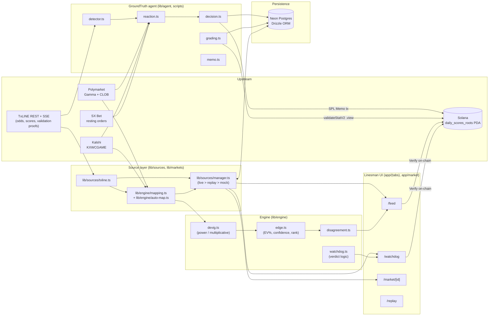
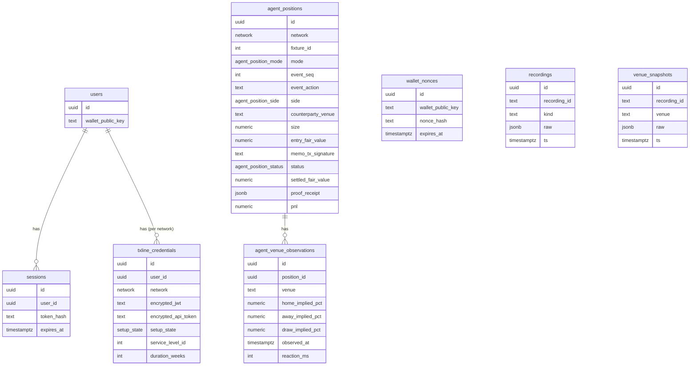
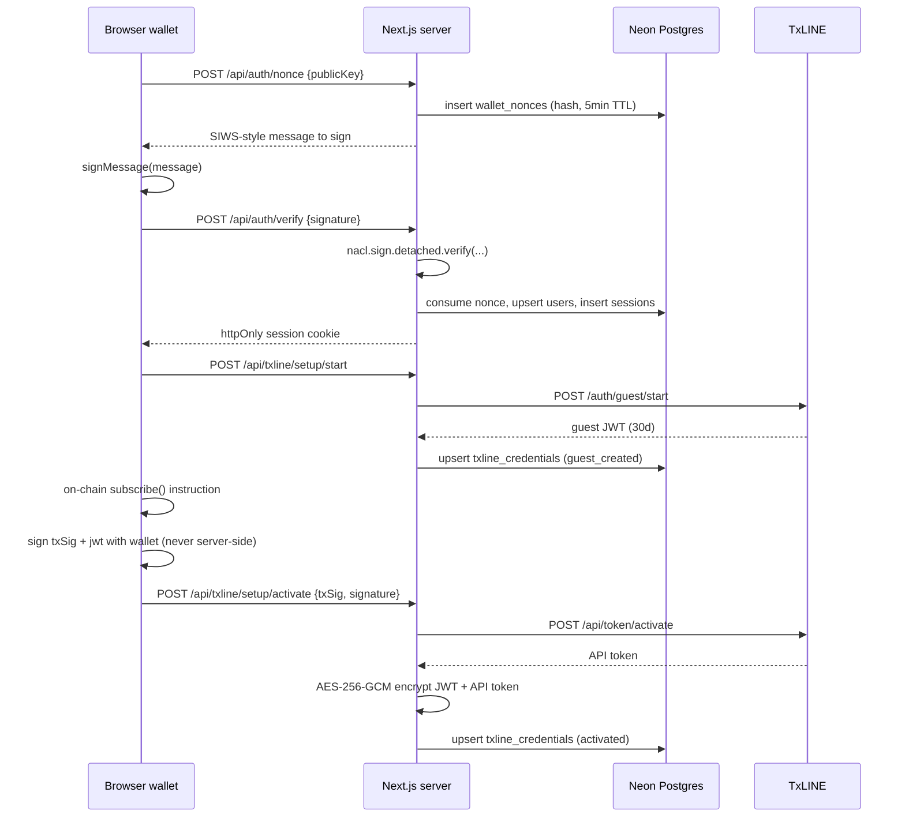
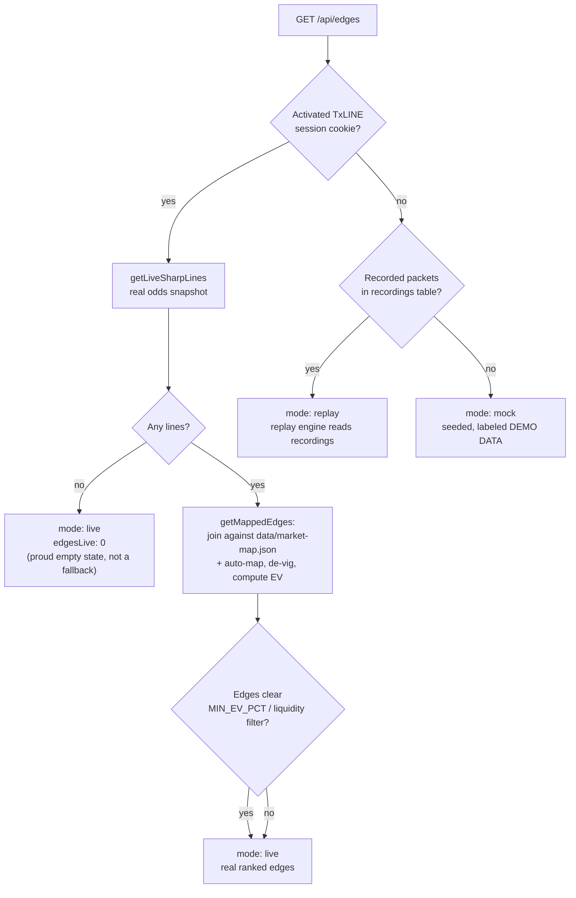
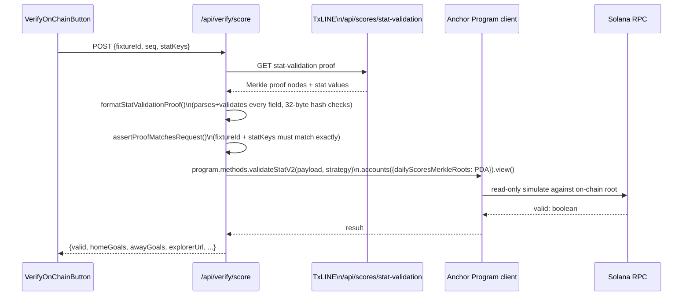
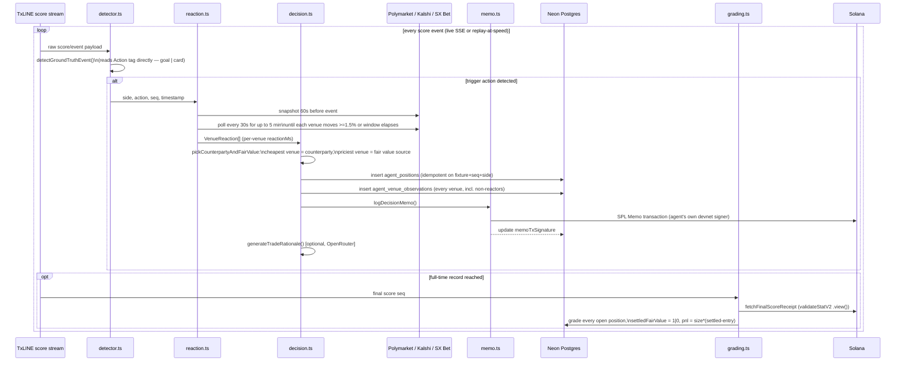

# Linesman × GroundTruth — Technical Design Document

**TxODDS × Solana World Cup Hackathon — Prediction Markets & Settlement / Trading Tools & Agents**

This document is the deep architectural reference for the submission. The [`README.md`](README.md) and [`PRODUCT_BRIEF.md`](PRODUCT_BRIEF.md) are the fast-read pitch; this is the "explain every line in the interview" document.

---

## Table of contents

1. [System overview](#1-system-overview)
2. [Why TxLINE is the load-bearing dependency](#2-why-txline-is-the-load-bearing-dependency)
3. [High-level architecture](#3-high-level-architecture)
4. [Data model](#4-data-model)
5. [Trust & auth: from wallet signature to TxLINE credential](#5-trust--auth-from-wallet-signature-to-txline-credential)
6. [The Source Manager — a single honest fact about "where did this number come from"](#6-the-source-manager--a-single-honest-fact-about-where-did-this-number-come-from)
7. [The mapping + de-vig + edge pipeline](#7-the-mapping--de-vig--edge-pipeline)
8. [Disagreement Index](#8-disagreement-index)
9. [Watchdog — settlement audit engine](#9-watchdog--settlement-audit-engine)
10. [On-chain verification: `validateStatV2`](#10-on-chain-verification-validatestatv2)
11. [GroundTruth — the autonomous latency agent](#11-groundtruth--the-autonomous-latency-agent)
12. [Replay engine & Showcase Mode](#12-replay-engine--showcase-mode)
13. [Mobile-first UI architecture & the phone-preview subsystem](#13-mobile-first-ui-architecture--the-phone-preview-subsystem)
14. [Security model](#14-security-model)
15. [Engineering quality — types, tests, lint](#15-engineering-quality--types-tests-lint)
16. [TxLINE endpoints actually used](#16-txline-endpoints-actually-used)
17. [Known limitations & explicitly flagged assumptions](#17-known-limitations--explicitly-flagged-assumptions)
18. [Track fit](#18-track-fit)
19. [Run it / repo map](#19-run-it--repo-map)

---

## 1. System overview

Linesman is two products sharing one trust rail:

- **Linesman (the cockpit)** — a mobile-first feed that joins TxLINE's de-vigged, Merkle-anchored fair-value line to live Polymarket/Kalshi books, ranks the resulting mispricing ("edge"), and audits whether a venue settled a market correctly against TxLINE's proven final score.
- **GroundTruth (the agent)** — a fully autonomous process that watches TxLINE's live score stream for goals/cards, measures which venue (Polymarket, Kalshi, SX Bet, or TxLINE's own bookmaker ticks) is slowest to reprice, trades against the slowest book at the fastest book's fair value, records the decision as a Solana memo, and grades itself against an on-chain final-score proof once the match ends.

Both are built on the same three primitives TxLINE provides: a **fair-value odds line**, a **live score/event stream**, and a **Merkle-proof validation primitive** on Solana. Everything downstream — the Feed, the Disagreement Index, the Watchdog, the agent's trade selection, the agent's grading — is derived from those three primitives plus public venue price data. Nothing in the product's core loop is invented; every number traces back to either a live upstream fetch or a value computed deterministically from one.

## 2. Why TxLINE is the load-bearing dependency

Prediction market venues (Polymarket, Kalshi) are **crowd prices** — they only tell you what traders currently think, not what's true, and they have no obligation to reprice quickly or correctly. Two problems fall out of that:

1. **No independent fair line.** Without a reference price computed outside any venue's own order book, "the crowd disagrees with itself" is the only claim you can make — you can't say which side of the disagreement is actually mispriced.
2. **No verifiable track record.** A trading bot's claimed P&L is just a number in a database until someone else can independently re-derive it. Screenshots aren't proof.

TxLINE solves both: it publishes a de-vigged fair-value line and match events, and anchors a Merkle root of each day's proven stats on-chain (`daily_scores_roots`, keyed by epoch day). That root is TxODDS's own commitment, written independently of this app — Linesman's job is to make that verifiable ground truth *legible* (Feed, Disagreement Index) and *actionable* (GroundTruth), and to let anyone re-check any claim against Solana directly.

## 3. High-level architecture



**Framework choices and why:**

| Concern | Choice | Reason |
|---|---|---|
| App framework | Next.js 16 App Router, Turbopack | Route groups (`(tabs)`) give one shared shell for Feed/Watchdog/Agent/Replay without duplicating layout; server components hit TxLINE/DB directly without a separate backend process. |
| Styling | Tailwind CSS v4 | Utility-first, zero runtime cost; CSS cascade-layer semantics required a deliberate fix (see [§17](#17-known-limitations--explicitly-flagged-assumptions)) once discovered. |
| Animation | Framer Motion | Layout animations for edge-card re-ranking, odometer-style number ticks, pulse rings on fresh packets — the "alive" feel a raw SSE dashboard lacks. |
| Client state | Zustand + `persist` | Small, serializable slices (replay clock, viewport mode) that need to survive navigation and reloads without prop-drilling or a heavier state library. |
| Data fetching | SWR | Polling with dedupe/revalidation for `/api/edges`, `/api/watchdog`, `/api/status` — cheap to reason about compared to hand-rolled polling + cache. |
| Charts | Recharts | Minimal sparkline/area needs (gap history, disagreement history) — full charting libraries would be overkill. |
| DB | Neon Postgres + Drizzle ORM | Serverless Postgres matches a Next.js serverless deploy target; Drizzle gives typed schema + typed queries with no code-gen step in dev. |
| Solana | `@solana/web3.js` + `@coral-xyz/anchor` | Anchor's `Program(...).methods.validateStatV2(...).view()` reproduces TxLINE's own proof-check without writing a transaction — exactly the read-only primitive the hackathon brief flags as valuable. |

## 4. Data model



Full source: [`src/db/schema.ts`](src/db/schema.ts). Two design details worth calling out to a reviewer:

- **`txline_credentials` has SQL `CHECK` constraints, not just app-level validation**, enforcing the state machine directly in Postgres: a row in `guest_created` state cannot carry subscription terms; a row in `subscribed`/`activated` state must carry a `duration_weeks = 4` and a network-appropriate `service_level_id` (`1` on devnet; `1` or `12` on mainnet). This means a bug in application code cannot silently write an inconsistent credential row — the database itself rejects it.
- **`agent_positions` has a compound uniqueness constraint** on `(fixture_id, event_seq, side)`, and `decision.ts` inserts with `.onConflictDoNothing(...)` against that exact target. This makes event processing **idempotent**: replaying the same TxLINE event twice (a network retry, a restarted agent process) cannot create a duplicate position.

## 5. Trust & auth: from wallet signature to TxLINE credential

TxLINE requires a Solana on-chain subscription before issuing a usable API token, and that token must never reach client JavaScript (it authorizes venue-fee-waived, real-time API access). Linesman's auth layer exists to bridge "a browser wallet" to "a server-held, encrypted TxLINE credential" safely:



Everything from here on (`lib/sources/manager.ts`, the agent scripts) reads the credential server-side via [`lib/txline/credentials.ts`](src/lib/txline/credentials.ts) and attaches both `Authorization: Bearer <jwt>` and `X-Api-Token` headers via [`lib/txline/client.ts`](src/lib/txline/client.ts) — the API token is decrypted only long enough to build one outgoing request, never serialized back to the browser.

## 6. The Source Manager — a single honest fact about "where did this number come from"

This is the module every screen is built around, and the one piece of engineering the hackathon judging criteria most directly reward ("core functionality with live/simulated feeds", "honest labeling"). [`lib/sources/manager.ts`](src/lib/sources/manager.ts) is the **only** module Feed, Watchdog, and Market Detail are allowed to call — never `lib/sources/mock.ts` directly — so the mode label rendered in the UI can never drift from what's actually backing the numbers on screen.



Three modes, one contract (`SourceStatus.mode: "live" | "replay" | "mock"`):

- **`live`** — an activated TxLINE session is returning real odds, *and* (ideally) at least one venue market has been joined via the mapping layer into a priced `Edge`. Critically: **an activated session that returns zero priced edges is still reported as `live`**, with a distinct "proud empty state" copy ("the market is honest right now") rather than silently degrading to `mock` — see `edgesFromLines` and the zero-lines branch in [`getSourceEdges`](src/lib/sources/manager.ts). This was a deliberate design call: silently backfilling with seeded cards the moment a real session has nothing to show would be dishonest, exactly the failure mode a judge reading the source code would (rightly) penalize.
- **`replay`** — no live session, but recorded TxLINE packets exist (`recordings` table, captured by [`lib/sources/recorder.ts`](src/lib/sources/recorder.ts) via `pnpm record`), or a Replay-tab focus is pinned to a previous fixture / the two historical semi-finals (real Polymarket/Kalshi ids replayed on a 1-minute candle cadence — see [`lib/sources/historical-semis.ts`](src/lib/sources/historical-semis.ts)).
- **`mock`** — last resort only, when neither of the above hold. Deterministic, seeded (`mulberry32` PRNG keyed off a hash of stable strings — see [`lib/sources/mock.ts`](src/lib/sources/mock.ts)), so the numbers are stable across restarts and the demo can't ever show a "broken" empty card mid-pitch. **Explicitly flagged in §17** — this exists and is real, but it never coexists with live data and the UI always labels it.

Every branch is wrapped in `try/catch` with a safe fallback (see `tryLiveSharpLines`, `edgesFromLines`) — the file's own top comment states the constraint directly: *"a source being down must never break a component (hackathon hard constraint)."*

## 7. The mapping + de-vig + edge pipeline

TxLINE's odds feed carries sharp fair value **per TxLINE fixture**; Polymarket/Kalshi carry prices **per venue market id**. Neither side publishes a lookup from one to the other — there is no public API that answers "which Polymarket market corresponds to TxLINE fixture 18209181." [`docs/FRICTION.md`](docs/FRICTION.md) documents this gap plainly; the mapping layer is the answer.

**Two mapping sources, merged with curated data winning ties:**

1. **Curated** — [`data/market-map.json`](data/market-map.json), a hand-built array of `MarketMapping` entries (`outcomeId`, `txline.{fixtureId,market,selection}`, one or more `{venue, venueMarketId, yesMeansSelection}` entries). Built with `pnpm discover-markets` ([`scripts/discover-markets.ts`](scripts/discover-markets.ts)), which lists live TxLINE fixtures next to live Polymarket World-Cup markets side-by-side and emits a JSON skeleton to fill in by hand.
2. **Auto-discovered** — [`lib/engine/auto-map.ts`](src/lib/engine/auto-map.ts) searches Polymarket/Kalshi live for a market whose team names loosely match a live TxLINE fixture's teams, cached 45s per fixture. Lower confidence (`"heuristic"` vs `"exact"`), used to fill gaps the curated file hasn't covered yet.

**De-vigging (`lib/engine/devig.ts`)** — a venue's raw "Yes" price for a single binary market already includes the venue's margin; you can't compare it directly to TxLINE's fair probability until the *whole book* (all outcomes of one market) is normalized to sum to 1. Two methods are implemented:

- **Multiplicative** — `p_i / sum(p)`. Simple, but distorts favourites and longshots by the same proportional amount.
- **Power** (`devigPower`, the default) — solves for `k` such that `sum(p_i^k) = 1` via bisection (widening `[lo, hi]` bounds until they bracket the root, then ~100 iterations of bisection to `1e-9` tolerance), then returns `p_i^k`. This shrinks the overround more where a probability is close to certainty, generally tracking real bookmaker margin behaviour better than the multiplicative method.

**A World Cup 1x2 market is genuinely three separate binary Yes/No markets on Polymarket** ("Will Spain win?", "Will it draw?", "Will Argentina win?"), each with its own id and its own small vig — not one 3-way market. `getMappedEdges` groups every mapping entry that shares a `fixtureId:market` key into one "book," and only de-vigs them together as a triple; a partial book (one leg's venue market unavailable) falls back to using each resolved leg's raw price rather than dropping the whole fixture, so one dead venue market can't blank out an entire match.

**Edge computation (`lib/engine/edge.ts`)**:

```
evPct = (fairProb / yesPrice - 1) * 100          // signed; +ve = venue underprices the true probability
confidence = f(liquidityUsd, line stability σ, mapping confidence)
rankScore  = |evPct| * ln(liquidityUsd + 1)       // big mispricing + real money behind it wins
```

Feed only surfaces edges that clear `MIN_EV_PCT = 3` **and** `MIN_LIQUIDITY_USD = 500` **and** at least `"medium"` confidence — filtering out noise from thin books or single-leg heuristic mappings before a fan ever sees the card.

## 8. Disagreement Index

A single 0–100 headline number answering "how far apart are the crowd and the sharps right now" ([`lib/engine/disagreement.ts`](src/lib/engine/disagreement.ts)): the liquidity-weighted mean of `|evPct|` across every currently-surfaced edge, scaled by a constant factor and clamped to `[0, 100]`. Rendered as a compact animated SVG dial on the Feed header ([`components/linesman/disagreement-dial.tsx`](src/components/linesman/disagreement-dial.tsx)), with a deterministic pseudo-history (`buildDisagreementHistory`) driving a 24-point sparkline without needing to persist a real time series yet.

## 9. Watchdog — settlement audit engine

Answers a different question than the Feed: not "is this mispriced right now" but **"did the venue settle this market correctly, and how fast?"** ([`lib/engine/watchdog.ts`](src/lib/engine/watchdog.ts)):

```
lagMinutes = round((venueResolvedAt - fullTimeAt) / 60_000)
matches    = venueResolution === provenResult      // provenResult comes from TxLINE, see §10
verdict    = !matches         → "incorrect"
           : lagMinutes > 60  → "late"
           : else             → "correct"
           (no resolvedAt yet → "unresolved")
```

Rows are sorted worst-first (`incorrect` > `late` > `unresolved` > `correct`, tie-broken by lag) — the scandal, if there is one, is always the top row. Two input paths feed `ClosedMarketRecord[]` into this pure function:

- **Real audits** — [`lib/engine/mapping.ts#getMappedClosedMarkets`](src/lib/engine/mapping.ts) finds mapped venue markets that have closed, fetches TxLINE's proven final result for the underlying fixture (`getFixtureProvenResult`), and compares the venue's own resolution against it.
- **Historical showcase audits** — [`lib/sources/historical-semis.ts`](src/lib/sources/historical-semis.ts) provides the same shape against real, historical Polymarket/Kalshi market ids for the two World Cup semi-finals, so Watchdog is never a blank page mid-demo even before a live match closes a mapped market.

Every row can be verified against the same on-chain call the Feed uses (§10) via a **Verify on-chain** button (tap-to-expand row → [`components/linesman/verify-onchain-button.tsx`](src/components/linesman/verify-onchain-button.tsx)).

## 10. On-chain verification: `validateStatV2`

This is the piece the hackathon organizers explicitly said they'd reward: *"if your team chooses to design independent, custom check gates or validation logic using these primitives, your effort will be highly valued by the judges."*

**What's anchored.** TxODDS commits a Merkle root of each day's proven fixture stats to a program-derived account seeded `"daily_scores_roots"` + little-endian `u16` epoch day (`timestamp_ms / 86_400_000`), once per day, independent of this app.

**What we verify, end to end:**



- [`lib/txline/validation.ts`](src/lib/txline/validation.ts) — parses TxLINE's raw proof response into the exact shape the on-chain instruction expects: `fixtureSummary` (fixture id, update-count/min/max timestamps as `BN`), `eventsSubTreeRoot`, `subTreeProof`/`mainTreeProof` (arrays of `{hash: number[32], isRightSibling: boolean}`), and a `discretePredicates` strategy (one exact-equality predicate per requested stat key — TxLINE's V2 API requires every stat to be covered by exactly one predicate or the call fails with `IncompleteStatCoverage`). Every field is validated defensively (`bytes32()` rejects anything that isn't exactly 32 integers 0–255) before it's ever sent to the chain.
- The PDA is derived client-side exactly as TxLINE derives it: `findProgramAddressSync([Buffer.from("daily_scores_roots"), new BN(epochDay).toBuffer("le", 2)], programId)`.
- The call itself is `.view()` — **no transaction, no fee, no signer risk** — Anchor simulates the instruction and returns the boolean the on-chain program computed, so *Solana itself* is the one confirming or rejecting the proof, not our server.

**The graceful fallback ladder** (documented in [`docs/ONCHAIN.md`](docs/ONCHAIN.md)): a card only has a real numeric TxLINE fixture id once it's from a live, activated session. If that's not the case — or the on-chain call fails for any reason (no session, RPC error, unsupported network) — the button falls back to displaying the packet's *already-anchored* Merkle root hash and a Solana Explorer link for its transaction. That fallback is still a genuine on-chain artifact; it's a receipt rather than a fresh re-check. **The button is never a dead end**: every branch resolves to either a live verification result or a real anchored receipt.

**Headless proof** — [`scripts/verify-cli.ts`](scripts/verify-cli.ts) (`pnpm verify -- --fixture <id> --seq 0 --stats 0,1`) runs the identical fetch → format → `.view()` call from a terminal with no browser or session cookie, just a TxLINE credential and an RPC connection — the same shape a keeper bot or a judge's own script could call.

## 11. GroundTruth — the autonomous latency agent

GroundTruth is a separate, standalone process (`pnpm agent:run`) that runs the full detect → decide → log → grade loop with **zero manual steps** once started — the specific bar the Trading Tools & Agents track sets ("full autonomy... zero manual intervention once deployed").



**Detection** ([`lib/agent/detector.ts`](src/lib/agent/detector.ts)) reads TxLINE's own `Action` tag directly off each record (`"goal"` / `"card"`) rather than diffing a running score total — diffing would miss cards entirely and could misattribute simultaneous goals in one tick.

**Reaction measurement** ([`lib/agent/reaction.ts`](src/lib/agent/reaction.ts), decision loop in [`lib/agent/decision.ts`](src/lib/agent/decision.ts)) polls every venue (real wall-clock time live; virtual timestamps in replay mode) until each has either moved more than 1.5 percentage points or a 5-minute window elapses, recording each venue's own reaction time independently — venues that never move within the window are still recorded, just with `reactionMs: null`.

**The trade selection rule is the strategically defensible part.** The counterparty is **not** simply "whichever venue hasn't reacted yet" — a venue can fail to cross the reaction threshold while still being priced *correctly* relative to another slow-but-differently-primed venue, and trading against it wouldn't be a genuine arbitrage, just a directional bet with no measured price edge. Instead (`pickCounterpartyAndFairValue`): sort every venue's currently implied probability for the backed side; the **cheapest** is the counterparty (the side the agent effectively "buys" at a discount); the **priciest** is the fair-value source (the market's own best available read of where the price has already converged). This requires at least two priced venues with `cheapest < priciest` — a real, measured price gap, not a coin flip.

**On-chain audit trail without a custom Anchor program.** Every decision is logged as an **SPL Memo** transaction ([`lib/agent/memo.ts`](src/lib/agent/memo.ts)) — a JSON payload (`fixtureId, seq, action, side, counterparty, entryFairValue, ts`) written by the agent's own funded devnet keypair (`AGENT_DEVNET_SECRET_KEY_BASE58`, deliberately never the end user's wallet). This is a genuinely tamper-evident, timestamped, third-party-auditable record — anyone can pull the transaction from Solana Explorer and read the exact decision without trusting this app's database. Memo logging failure is caught and logged, never rolling back the trade record itself: the position is real even if the on-chain receipt for it briefly fails (e.g. an unfunded devnet signer).

**Grading** ([`lib/agent/grading.ts`](src/lib/agent/grading.ts)) fetches and on-chain-verifies the fixture's final home/away goal tally via the identical `validateStatV2` `.view()` call §10 describes, resolves a winner (or `null` for a draw), and grades every open position: `settledFairValue = 1` if the backed side actually won else `0`; `pnl = size * (settledFairValue - entryFairValue)`, following the same linear probability-contract convention the venues themselves use. **If the on-chain proof doesn't validate, grading throws rather than guessing** — no position is ever graded off an unverified score.

**Optional LLM rationale** ([`lib/agent/rationale.ts`](src/lib/agent/rationale.ts)) generates a one-sentence, plain-English explanation of an *already-decided* trade via OpenRouter — explicitly decorative, wrapped in `try/catch` returning `null` on any failure, and never in the decision path. The trade itself is 100% deterministic arithmetic; the model never sees the decision before it's made.

## 12. Replay engine & Showcase Mode

The tournament schedule and the judging window don't overlap cleanly — most matches judges could watch live will already be over by review time. Two complementary mechanisms make "live behavior" demoable on demand with **real** data, not synthetic data:

- **TxLINE historical replay** — `GET /api/scores/historical/{fixtureId}` returns the full proven score sequence for any fixture from the last two weeks. [`lib/agent/ingest.ts#replayAtSpeed`](src/lib/agent/ingest.ts) re-emits those events at an accelerated multiplier (capped per-step wait so long real-world gaps like half-time can't stall a demo), feeding the exact same `detectGroundTruthEvent` → `processGroundTruthEvent` path the live agent uses — replay isn't a separate code path, it's the same pipeline fed a different event source.
- **Recorder + replay engine for the Feed/UI** — [`lib/sources/recorder.ts`](src/lib/sources/recorder.ts) taps the live SSE stream and appends raw packets verbatim to the `recordings` table (zero transformation on write); [`lib/engine/replay.ts`](src/lib/engine/replay.ts) reads them back on a wall-clock-driven fraction of elapsed time, so the Replay tab's scrub bar and the Feed's "replay" mode both derive from one recorded session.
- **Historical-venue showcase** ([`lib/sources/historical-semis.ts`](src/lib/sources/historical-semis.ts)) goes one step further for the two World Cup semi-finals specifically: it replays *real* Polymarket/Kalshi 1-minute price candles alongside TxLINE's historical score sequence, so Feed/Watchdog gaps genuinely open and close in sync with real goals on a known, always-available fixture — the most reliable demo path when no match is live.

## 13. Mobile-first UI architecture & the phone-preview subsystem

The brief called the **phone the primary judged viewport**. Two things were engineered for that beyond responsive CSS:

- **Full mobile pass**: bottom tab bar respecting `env(safe-area-inset-bottom)`, ≥44px touch targets throughout, sticky bottom action bars on Market Detail (`components/linesman/market-detail-action-bar.tsx`), a live ticker that collapses to a sticky 28px strip, horizontally thumb-scrollable filter chips, tap-to-expand Watchdog rows.
- **A genuine phone-viewport simulator on desktop** (`/showcase` route and an in-app Desktop/Phone toggle in the sidebar) — rendering the *actual* interactive app inside a real 390×844 browsing context via an `<iframe>`, rather than a CSS-scaled div, so every responsive Tailwind breakpoint resolves against a true mobile viewport.

That iframe approach has a sharp edge that caused a real production bug (**"Rendered fewer hooks than expected"**) and is worth documenting because the fix illustrates a fundamental React rule: **all hooks in a component must run unconditionally, every render.** The original viewport component called `useState` *after* an early return based on the current phone/desktop mode — so the hook count for that component instance literally changed between renders whenever the mode flipped. It also risked infinite iframe nesting (the iframe shares `localStorage` with its parent, so any in-app link clicked *inside* the preview would read the persisted "phone" mode straight back and re-open the overlay recursively).

The fix centralizes both concerns into one hook, [`lib/hooks/use-phone-preview-active.ts`](src/lib/hooks/use-phone-preview-active.ts):

```ts
export function usePhonePreviewActive(): boolean {
  const storeMode = useViewportStore((state) => state.mode);
  const searchParams = useSearchParams();
  const urlView = searchParams.get("view");

  if (typeof window !== "undefined" && window.self !== window.top) return false; // (1)
  if (urlView === "desktop") return false;
  return urlView === "phone" || storeMode === "phone";
}
```

1. `window.self !== window.top` — any document already running inside *any* iframe never re-activates the overlay, no matter what's in `localStorage` — this single check eliminates the recursive-nesting class of bug entirely.

[`PhonePreviewOverlay`](src/components/linesman/phone-preview-overlay.tsx) then owns the **entire viewport** as a fixed, full-screen element (not a panel beside the desktop sidebar), so the desktop chrome underneath is fully hidden — no double header/footer, nothing bleeding in from the edges. [`PhonePreviewGate`](src/components/linesman/phone-preview-gate.tsx) unmounts the outer page's content while the overlay is active, so SWR polling and the replay clock don't run twice in the background. Both call `usePhonePreviewActive()` unconditionally, so neither can trigger the original hook-count bug again.

## 14. Security model

- **Wallet auth is a real signature check**, not a client-trusted claim: `verifyLoginAndCreateSession` decodes the base58 public key, verifies an Ed25519 detached signature (`tweetnacl`) against a server-issued, single-use, time-boxed nonce (hashed at rest, `wallet_nonces.nonce_hash`), and only then mints a session.
- **Sessions** are opaque random tokens (`randomBytes(32)`), stored only as a SHA-256 hash server-side (`sessions.token_hash`) — the raw token exists only in an `httpOnly`, `sameSite=lax`, `secure`-in-production cookie; a database leak alone can't be replayed into a session.
- **TxLINE credentials are encrypted at rest**: `lib/security/encryption.ts` uses AES-256-GCM with a per-secret random 96-bit IV and an auth tag, keyed by `CREDENTIAL_ENCRYPTION_KEY_BASE64` (32 raw bytes) — a DB dump alone cannot recover a usable JWT/API token without that separately-held key.
- **Same-origin enforcement** (`assertSameOrigin`) and a simple in-memory sliding-window rate limiter (`enforceRateLimit`) guard the state-changing auth/setup routes.
- **`server-only` guards** (`import "server-only"`) on every module touching the DB, credentials, or the agent signer make it a build-time error, not just a convention, for that code to be pulled into a client bundle.
- **The agent's Solana keypair is fully isolated from the user's wallet** — `AGENT_DEVNET_SECRET_KEY_BASE58` is a separate, purpose-funded devnet signer; a compromised agent process can never touch a real user's funds because it never holds their key.

## 15. Engineering quality — types, tests, lint

- **TypeScript strict throughout** — `pnpm typecheck` (`tsc --noEmit`) passes clean.
- **73 unit tests across 18 files** (`pnpm test`, Vitest) covering de-vig math, credential state-machine boundaries, auth message construction, TxLINE score/odds parsing, route input validation, encryption round-trips, SSE decoding — all currently green.
- **Playwright e2e** (`e2e/happy-path.spec.ts`, `playwright.config.ts`) drives the actual browser for the primary navigation flow; also used ad hoc during development to visually confirm layout at 390×844 and 360×800.
- **ESLint** (`eslint.config.mjs`, Next's flat config) enforced project-wide including hooks-correctness rules (`react-hooks/exhaustive-deps`, purity/set-state-in-render rules), which is what caught several of the render-timing bugs documented in `docs/FRICTION.md` before they shipped.
- **Deterministic-by-design where it matters**: the seeded PRNG in `lib/sources/mock.ts`, the bisection solver in `devigPower`, the idempotent `agent_positions` insert — none of the core computation depends on wall-clock nondeterminism or external call ordering to produce a reproducible result.

## 16. TxLINE endpoints actually used

| Endpoint | Method | Used by | Purpose |
|---|---|---|---|
| `/auth/guest/start` | POST | `lib/txline/client.ts`, setup start/reset | Issue/renew a guest JWT before wallet subscription. |
| `/api/token/activate` | POST | `api/txline/setup/activate` | Exchange a confirmed on-chain subscription for a service API token. |
| `/api/fixtures/snapshot` | GET | `api/txline/fixtures`, `lib/sources/txline.ts` | List fixtures for the connected network. |
| `/api/odds/snapshot/{fixtureId}` | GET | `lib/sources/txline.ts` | The real sharp-line source — latest odds tick per fixture. |
| `/api/scores/snapshot/{fixtureId}` | GET | `api/txline/scores/[fixtureId]` | Latest score/stat tick. |
| `/api/scores/historical/{fixtureId}` | GET | `api/txline/history`, `lib/agent/ingest.ts` | Full score sequence for replay — the agent's and Feed's demo lifeline. |
| `/api/scores/stat-validation` | GET | `api/txline/validate`, `lib/agent/grading.ts` | Merkle proof of a proven stat — input to `validateStatV2`. |
| `/api/{odds,scores}/stream` | GET (SSE) | `api/txline/stream/[kind]`, `lib/agent/ingest.ts` | Live packet streams — tap point for the recorder and the live agent. |
| `validateStatV2` (Anchor `.view()`) | on-chain | `api/txline/validate`, `lib/agent/grading.ts`, `scripts/verify-cli.ts` | The trust primitive: confirms a proof against the on-chain `daily_scores_roots` PDA. |

Full inventory including third-party venue endpoints and this app's own API surface: [`docs/ENDPOINTS.md`](docs/ENDPOINTS.md).

## 17. Known limitations & explicitly flagged assumptions

Flagged deliberately and in detail, per the project's own honesty principle — a judge (or teammate) reading the source should hit no surprises:

1. **A labeled, last-resort mock fallback genuinely exists** ([`lib/sources/mock.ts`](src/lib/sources/mock.ts), 545 lines, deterministic seeded PRNG). It is **only** reachable when there is no activated live TxLINE session *and* no recorded/replayable session available (§6's third rung), it is never blended with live data, and the UI always renders a distinct `"DEMO DATA"` chip when it's active (`components/linesman/freshness-chip.tsx`). This is a deliberate cold-start/demo safety net — the app must still be presentable the instant it's opened with no wallet connected — not a shortcut used to fake the live path. If you'd rather the submission show *zero* mock code, the two options are: remove `lib/sources/mock.ts` and the `mock` rung entirely (Feed/Watchdog would then show an explicit "connect a wallet" empty state instead of seeded cards on cold start), or keep it but make that limitation prominent in the demo video narration. Flagging this explicitly per your request — happy to strip it if you'd rather ship with none.
2. **`validateStatV2` stat keys are placeholders** (`HOME_GOALS_STAT_KEY = 1`, `AWAY_GOALS_STAT_KEY = 2` in `lib/agent/grading.ts`; `[0, 1]` in `api/verify/score`) — TxLINE's real integer→stat registry isn't publicly documented, so these are best-effort guesses that exercise the correct proof format and on-chain call shape, but need TxLINE's actual key table to resolve semantically rather than just structurally. This is exactly the kind of concrete "API feedback" the hackathon explicitly asks submissions to provide.
3. **`getFixtureProvenResult`'s score-shape parsing is defensive, not verified against a real finished fixture** — no fixture finished during a live, activated session while this was built, so it tries several plausible key names and returns `null` (dropping that fixture from the audit) rather than fabricating a verdict on anything unexpected. Documented with a to-do to tighten against a real payload in `docs/FRICTION.md`.
4. **No public API maps a TxLINE fixture to a venue market** — this is a genuine gap in the wider ecosystem, not just this app; `data/market-map.json` + `scripts/discover-markets.ts` make the one-time human curation step as cheap as possible, and `lib/engine/auto-map.ts` narrows it further with team-name heuristics, but a brand-new, unmapped fixture will show TxLINE connectivity (`liveTxlineConnected: true`) without a priced edge until it's mapped.
5. **The replay-mode agent can only see Polymarket + Kalshi** (both have public historical price archives); SX Bet and TxLINE's own per-bookmaker ticks are live-only paths, since neither exposes historical order data.

## 18. Track fit

| Criterion (organizers' own language) | Where this repo hits it |
|---|---|
| "custom validation logic using [Merkle-proof] primitives... highly valued" | §10 — full client-side proof formatting + `.view()` call against `daily_scores_roots`, reused identically by the UI, the agent's grading step, and a standalone CLI. |
| "core functionality with live/simulated feeds" | §6 — the Source Manager's honest three-mode fallback chain, never silently mixing modes. |
| "full autonomy... zero manual intervention once deployed" | §11 — `pnpm agent:run` runs unattended: detect → decide → log → grade. |
| "clean deterministic, strategically defensible logic" | §11 — the cheapest-venue / priciest-fair-value selection rule is a measured, arguable trading rule, not vibes; §7's de-vig math is a named, standard technique. |
| "production readiness" | §14–15 — encrypted credentials, SQL-enforced state machine, idempotent event processing, typed strict, tested, linted. |
| Consumer/fan polish | §13 — mobile-first pass, phone-preview showcase, Disagreement Index as an at-a-glance headline number. |

## 19. Run it / repo map

See [`README.md`](README.md) for exact setup commands and env vars. Directory map for a first-time reviewer:

```
src/db/                 Drizzle schema + client
src/lib/auth/           Wallet-signature login, sessions
src/lib/txline/         TxLINE client, SSE decoding, Merkle proof formatting, credentials
src/lib/security/       AES-256-GCM secret encryption
src/lib/sources/        Per-venue/per-source adapters + the manager facade (§6)
src/lib/engine/         devig, edge, mapping, disagreement, watchdog, replay, auto-map (§7-9,12)
src/lib/solana/         Explorer-link / proof display helpers
src/lib/agent/          GroundTruth: detector, reaction, decision, memo, grading, rationale (§11)
src/lib/markets/        Polymarket/Kalshi/SX Bet adapters used by the agent's reaction measurement
src/app/(tabs)/         Feed, Watchdog, Agent, Replay — shared tab-bar shell
src/app/market/[id]/    Market Detail
src/app/api/            All internal API routes (edges, watchdog, verify, status, health, agent, internal/*)
src/components/linesman/  Product UI components
scripts/                verify-cli, record, discover-markets, agent-run, agent-backtest-report
docs/                   ONCHAIN.md, ENDPOINTS.md, FRICTION.md (append-only integration log)
data/                   market-map.json (curated venue mapping)
```
